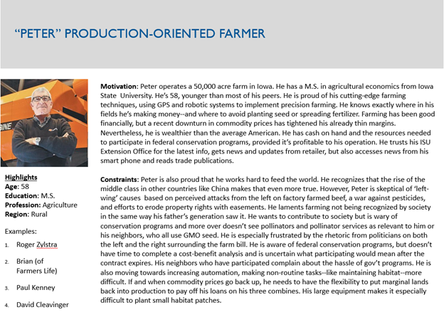

# Persona Development Guide

Personas include (1) a name, (2) a photo, (3) a screening question that will help distinguish those that fit the persona and those that don’t and (4) a description of relevant motivations and constraints. You can use a template or simply write down one or two paragraphs. The persona profile should fit on a single page or PowerPoint slide. The goal is to personalize the stakeholder so you understand their perspective and allow you to advocate on their behalf while developing solutions. Here is a quick and simple process:

1. Start by dumping a list of all the personas you think might be relevant. List them by name, such as ‘Fred the Farmer’. Ultimately, you’ll need to focus on the ones that are most relevant (you can’t make everyone happy), but for now more is more*.
2. Next, rank the personas and group redundant ones. Who do you need to appeal to first to achieve your vision? Who is most likely to help or hurt your cause?
3. Draft screening questions for each priority persona. This is one sentence that ‘defines’ who the persona is and allows you to determine if someone fits the bill (e.g., do you depend entirely on farm income for your livelihood?)
4. Write down at least 5 people that fit the persona. You don’t have to know these people, but they must exist. Use one of their photos for the persona profile.
5. Now spend less than 30 minutes per persona to start a draft. You will find that you may be very ignorant and stereotypical at this point—that’s fine, overcoming that is what this exercise is all about! Next you will research and refine your personas.

\* Sometimes, it's best to use a different pattern for categorizing personas instead of people, which can carry connotations that you don't mean to include. For example, categorize them by their shoes (wingtips, steel toes, and tevas), where they go on vacation (snow birds, summer in france, timeshares), or something else relevant to your project.

#### Example

This example was used in our effort to encourage farmers to participate in a cost-share conservation project (the Monarch Habitat Exchange).

#### Acknowledgements

This guide was adapted from Alex Cowan's excellent guide, which you can find [here]( https://www.alexandercowan.com/tutorial-personas-problem-scenarios-user-stories/ ).

