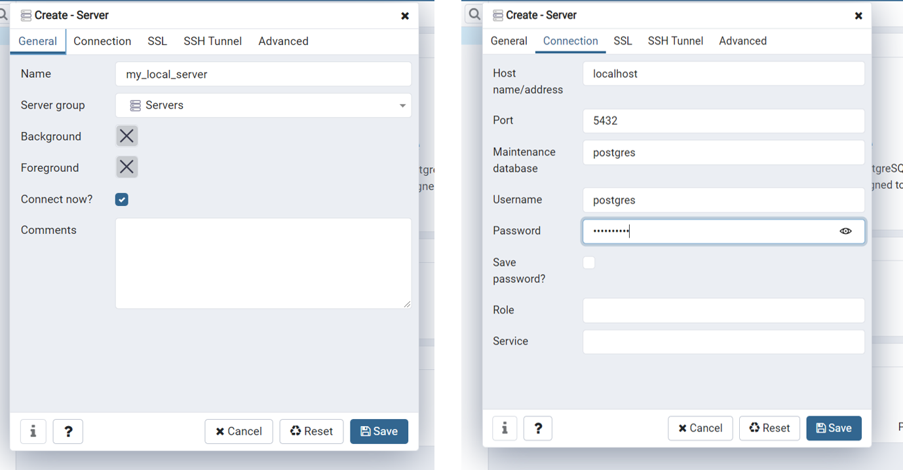
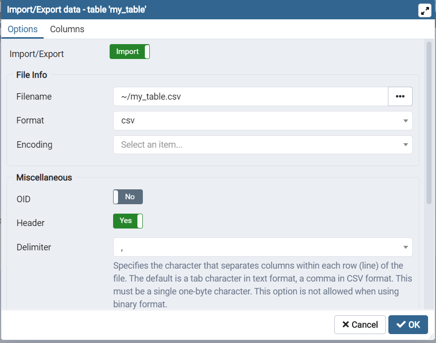
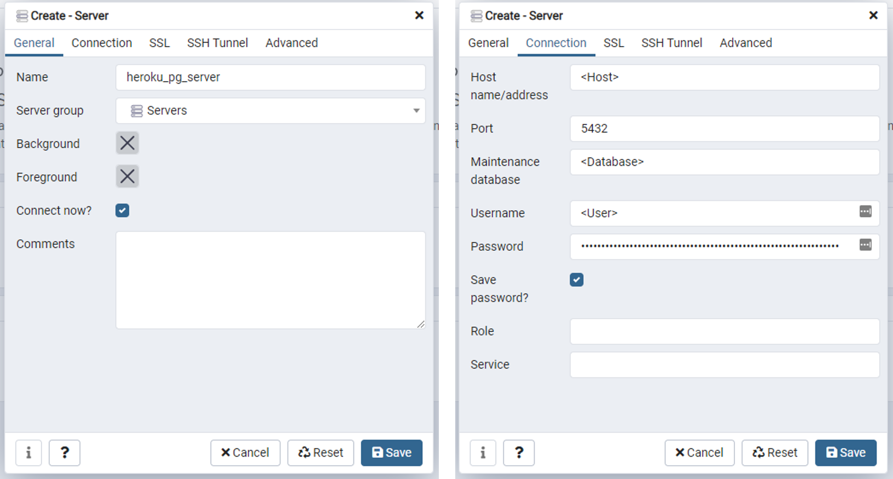

This tutorial demonstrates how to integrate a Postgres database with a Dash app. First, we'll set up a local Postgres database for testing and then provision a Postgres database through Heroku. Credit to [Charming Data](https://www.youtube.com/watch?v=Mf3s0P4aVKw) for his tutorial and inspiration for this tutorial. 

### 1. Install Postgres

Visit the [Postgres website](https://www.postgresql.org/) and download the right version of Postgres for your operating system (note that you may need to use a different browser if the download does not start automatically).

Once the install begins, follow [these instructions](https://www.postgresqltutorial.com/install-postgresql/) to set up Postgres on your local machine. Uncheck 'Stack Builder' when prompted, you won't need it. Make sure you write down the superuser password you set up! 

This installation will automatically install pgAdmin, the default database management client for Postgres, and psql, a command line interface for Postgres. (If you're following the instructions linked above to verify your Postgres install, note that the password will not display on screen when you type it for security reasons).

### 2. Configure a local server

A local database will be used during development to test the app before we deploy to Heroku. 

Open pgAdmin (note pgAdmin opens in your browser). When you first open pgAdmin, you'll need to set a master password (for simplicity, I'd recommend using the same password you used to set up Postgres). 

Select 'Add New Server' (under Dashboard). Configure the new server following the images below. You may change the name of the server if you wish. Provide  the password used to install Postgres as the password here.



### 3. Set up a local database

In the left sidebar, right-click on `Databases` under`my_local_server` and select `Create> Database...`. Call the database `test` and save.

### 4. Create a table

In the left sidebar, navigate to `my_local_server> Databases> test> Schemas> Tables` to access the tables associated with the database. Since this is a new database, we'll need to create a table.  Note, if you called your database something other than `test`, you should navigate to your database in the tree.

Right-click `Tables` and select `Create> Table...`. Configure the new table following the images below. You may change the name of the table if you wish, but the name of the table will be used in our code so don't forget it. Use the 'plus' sign on the right to add columns.

If you have an existing CSV that you would like to import, make sure that the column names you create match exactly the column names in the CSV.


If you need help figuring out which data type to use, review the guidance [here](https://www.postgresqltutorial.com/postgresql-data-types/). The most common types are 'text', 'int', 'real', and 'date'.

### 5. Populate table

If you have an existing CSV, you can import it by right-clicking on the table in the left sidebar and selecting 'Import/Export'. Configure as shown below.



Otherwise, select 'View/Edit Data' to input data manually.

I'll be using a CSV like the one below to import data.

| Code | Project  | Practice_Area |
| ---- | -------- | ------------- |
| 1001 | MI2      | International |
| 1002 | LAC ESSC | International |

After importing, select 'View/Edit Data' from the my_table context menu (right-click) to confirm successful import.

### 6. Connect to the local database in the app

The code below illustrates how to connect to the database on your local server in a simple Dash app. 

We'll use SQLAlchemy through Flask (Dash is built on Flask) to connect to the database.

```python
# See Charming Data's tutorials at https://www.youtube.com/channel/UCqBFsuAz41sqWcFjZkqmJqQ/featured
import dash
from dash.dependencies import Input, Output, State
import dash_table
import dash_core_components as dcc
import dash_html_components as html

import pandas as pd
import os

from flask_sqlalchemy import SQLAlchemy
from flask import Flask

# app requires "pip install psycopg2" as well

server = Flask(__name__)
app = dash.Dash(__name__, server=server, suppress_callback_exceptions=True)
app.server.config['SQLALCHEMY_TRACK_MODIFICATIONS'] = False

# for your home PostgreSQL test table, replace <password>
# Format: "postgresql://<username>:<password>@<host name/address>/<database name>"
app.server.config["SQLALCHEMY_DATABASE_URI"] = "postgresql://postgres:<password>@localhost/test"

db = SQLAlchemy(app.server)


# ------------------------------------------------------------------------------------------------

app.layout = html.Div([
    html.Div(id='postgres_datatable'),
    dcc.Interval(id='interval_pg', interval=86400000*7, n_intervals=0)
    ]
)


# ------------------------------------------------------------------------------------------------


@app.callback(Output('postgres_datatable', 'children'),
              [Input('interval_pg', 'n_intervals')])
def populate_datatable(n_intervals):
    df = pd.read_sql_table('my_table', con=db.engine)
    return [
        dash_table.DataTable(
            id='our-table',
            columns=[{
                         'name': str(x),
                         'id': str(x),
                         'deletable': False,
                     } 
                     for x in df.columns],
            data=df.to_dict('records'),
            editable=True,
            row_deletable=True,
            filter_action="native",
            sort_action="native",  # give user capability to sort columns
            sort_mode="single",  # sort across 'multi' or 'single' columns
            page_action='none',  # render all of the data at once. No paging.
            style_table={'height': '300px', 'overflowY': 'auto'},
            style_cell={'textAlign': 'left', 'minWidth': '100px', 'width': '100px', 'maxWidth': '100px'},
            style_cell_conditional=[
                {
                    'if': {'column_id': c},
                    'textAlign': 'right'
                } for c in ['Price', 'Sales']
            ]

        ),
    ]


if __name__ == '__main__':
    app.run_server(debug=True)
```

 Note how we set up a server using Flask, configured the SQLAlchemy Database URI connection string, and instantiated a database connection object `db = SQLAlchemy(app.server)`, highlighted below.

```python
# code specific to SQLAlchemy
from flask_sqlalchemy import SQLAlchemy
from flask import Flask

server = Flask(__name__)
app = dash.Dash(__name__, server=server, suppress_callback_exceptions=True)
app.server.config['SQLALCHEMY_TRACK_MODIFICATIONS'] = False

app.server.config["SQLALCHEMY_DATABASE_URI"] = "postgresql://postgres:<password>@localhost/test"

db = SQLAlchemy(app.server)
```

To read in the table, we use pandas' `pd.read_sql_table`, passing `db.engine` as the connection object.

```python
# code specific to reading sql tables
import pandas as pd

df = pd.read_sql_table('my_table', con=db.engine)
```

### 7. Deploy app to Heroku and provision a database

Next, we'll deploy the app to Heroku and provision a database using the Heroku Postgres add-on. If you need guidance on deploying to Heroku, see [our tutorial](../deployment/heroku.md).

Open the app at Heroku.com and click on 'Resources' to provision a Postgres database. Search for 'postgres', select 'Heroku Postgres', and click 'Provision' (you can use the Free version for this demo).

### 7. Connect to the remote database in pgAdmin

In 'Resources' you should see the add-on you provisioned. Click on it, click 'Settings', and 'View Credentials'. You'll need this info to connect to the server through pgAdmin on your computer, and to use this database in your app.

Open pgAdmin and in the left sidebar, right-click on 'Servers' and select 'Create Server'. By copying and pasting the credentials from Heroku, provision the server. In the images below, I've typed the corresponding field from Heroku to use in pgAdmin. The password should also be copied over.



You should now be able to find your database in the list of databases within the server you just set up. There will be hundreds of databases in that list, use Ctrl+F and search for the database name to find it quickly (it will be colored gold).

Note that the credentials you used may be 'rotated' (changed) by Heroku. This won't affect your app, but it will affect your connection through pgAdmin. If you can't find your database in pgAdmin, just repeat this step.

Repeat steps 4 and 5 to create and populate tables in your new database.

### 8. Connect your app to your remote database

Now you're ready to connect your app to your remote database!

You'll want to keep your database credentials out of git and GitHub, so we'll use an [environment variable](../development/environment-variables). Helpfully, Heroku creates a `DATABASE_URL` environment variable for you when provisioning the database. You can check this at your app page in Heroku: select 'Settings' and click 'Reveal Config Vars'. 

Simply swap out your local connection string with the database URI provided for you Heroku database using the environment variable created by Heroku (you can find the URI listed in the database credentials under Settings).

```python
import os

app.server.config["SQLALCHEMY_DATABASE_URI"] = os.environ['DATABASE_URL']
```

Note you will need to install `psycopg2` in your environment if you haven't already. Update your requirements.txt and re-deploy the app with the new connection details.

If you want to test your app locally, you can set up a `database_uri.json` file in your `secrets/` directory to store the URI. Here's what that file would look like:

```json
{
    "DATABASE_URI": "<DATABASE URI>"
}
```

You can use a try/except block to handle connections:

```python
import json

try:
    app.server.config["SQLALCHEMY_DATABASE_URI"] = os.environ['DATABASE_URL']
except:
    with open ('secrets/database_uri.json') as f:
        app.server.config["SQLALCHEMY_DATABASE_URI"] = json.load(f).get("DATABASE_URI")
```

For more info on Heroku Postgres, [read the docs](https://devcenter.heroku.com/articles/heroku-postgresql).

