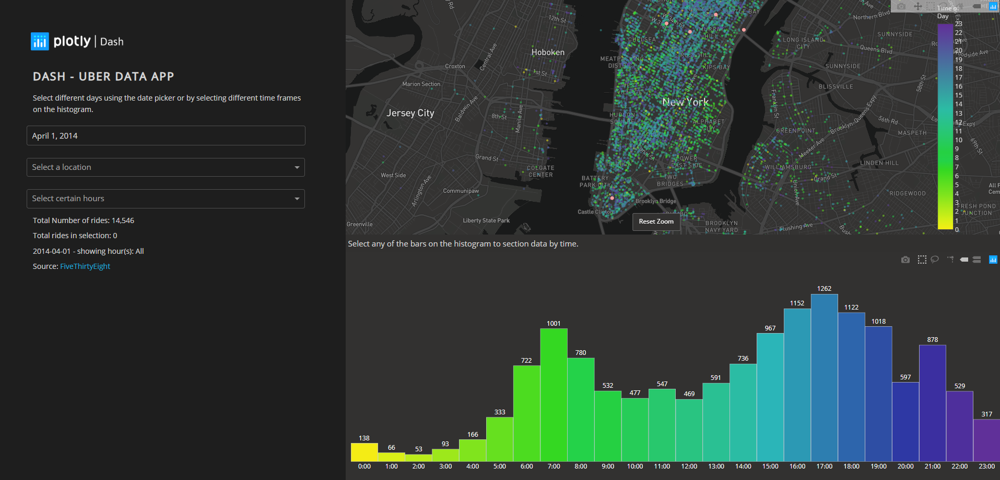

# Dashboards

Dashboards promise to distill meaning from complexity and facilitate at-a-glance performance monitoring. However, if poorly designed, they can result in an overwhelming array of incoherent data visualizations that confuse more than illuminate. There's a reason we don't all walk around wearing [Tony Stark's helmet](https://cdn0.tnwcdn.com/wp-content/blogs.dir/1/files/2012/06/Iron_Man_Mark_VII_HUD_design_By_Jayse_Hansen_1400.png). 

This page will help you [design a dashboard](#designing-a-dashboard) and [select a platform](#selecting-a-platform) to implement it.

## Designing a dashboard

If you haven't already, review the [introduction to data visualization](data-visualization.md); it will help you through the process of designing the components of the dashboard. Here are some additional considerations specific to design of a dashboard.

#### Consider audience and purpose

As with any data visualization, you'll want to start by considering the purpose of the dashboard and who will be using it. You should list and prioritize the questions you'd like your dashboard to address before you start designing.

Dashboards are commonly categorized as either operational, strategic, or analytical. Operational dashboards focus on monitoring the status of key components of the system. Strategic dashboards allow for quick review of performance indicators. Analytical dashboards are intended to facilitate understanding of the system. Because the purpose of these dashboards are different, the design will also likely differ.

#### Be concise and purposeful

There is a real temptation to throw everything you can on a dashboard. Resist. If you can eliminate something, do it. If you can combine two things without cluttering or confusing, do it. Don't add animations or interactions simply because you can. 

Remember that your purpose is to help a decision maker answer a question quickly. Always weigh the value of an additional feature against the value for the decision maker.

#### Keep it to one view

In general, aim to keep your dashboard to a single screen. At the very least, you want to have one view that provides all of the highest priority information. If you must include more content through scrolling or additional pages, group content thematically so that there is no need to flip back and forth or scroll up and down. This might even mean repeating key information across multiple views.

If you want your dashboard to work on mobile devices, you'll need a responsive design. Keep in mind that this will almost certainly mean a different flow of information. It might not be possible to have all information on a single screen. Treat the responsive layout as its own layout.

#### Use interactions strategically

Interactions allow the user to drill down into data, manipulate parameters, or personalize the dashboard. These can be very helpful for progressively revealing information while maintaining the layout and size of your dashboard. 

However, the purpose of your dashboard is to surface information, not hide it behind a bunch of widgets. Your dashboard is not a puzzle. Avoid burying important information in interactions. 

You may also want to link to source data to allow the user to quickly access key resources.

#### Consider layout and flow

The user's eye typically follows an 'F' pattern across a screen, glancing from left to right while progressing down the left margin (depending on your region). Thus, place the most important elements in the top left of the screen. The bottom right will have the least important information. Group like content together. Finally, use white space liberally. An overly-dense data display can be disorienting and difficult to read.

Dashboards are often designed with *cards*, which allow for easy alignment and responsive design. Each card represents one element. You might divide your dashboard into a few rows and a handful of columns before deciding which element should go where. One element may take up multiple cells, but no cell should be split between multiple elements.

#### Be consistent with formatting

Make sure numbers are formatted correctly. Use sans-serif fonts. Make labels descriptive. Use well-known abbreviations when possible to reduce clutter (but make sure your audience knows what they mean). Repeat colors across multiple elements to highlight their identities. Keep text horizontal as much as possible. Consistent formatting will help communicate information and make your dashboard more appealing to the eye.

#### Provide context

Metrics should be presented with context. Show change over time, indicate the change since yesterday, illustrate the difference between the number and its target, color low performance red and high performance green. Just make sure your audience can quickly gauge the significance of any number and identify trends when it is important. If two indicators should be evaluated in relation to one another, keep them together.

## Selecting a platform

Dashboards are having a moment right now as startups and Fortune-500 companies alike are increasingly using data in their decision making. Platforms abound. Many of these are designed for marketing analytics and business intelligence use cases, but should have sufficient functionality for our purposes. Here are a few considerations when selecting a platform.

#### Cost

There are free options and there are subscription-based options. Subscriptions are not unreasonable, ranging from $30 to $200 a month and up. The budget options limit features like the amount of data you can use, the number of data sources, the number of dashboards, and the frequency of data updates. Carefully review the pricing tiers and their associated limitations before selecting a paid option.

#### Sharing and hosting

Consider how you will share the dashboard and where it will be hosted. I would suggest that to be really useful the dashboard should be available on the web. Many cloud-based platforms are available for hosting a web-based dashboard. However, make sure you don't share any personal or sensitive information publicly.

#### Integrations

Where do your data live now, and how are your data generated? You'll want whatever solution you select to integrate with your data source(s). Most solutions support an array of integrations, but if you are committed to using Google Sheets, and the platform doesn't support a Google Sheets integration, it won't work for you.

#### Simplicity and customization

There is a tradeoff between simplicity and customization. The truly easy-to-use platforms do not offer much in the way of customization (which is why they are easy to use). You won't always know what a platform can't do until you try to make it do that thing, which can be very frustrating. Stick to the reviewed platforms below and we can help you understand what can, and can't, be done.

#### Blending and computation

Data blending is the process of taking two data sources and combining them in a single dashboard. You may also want to do some computation on the data. Different platforms have different support for blending and computation. Many platforms require you use SQL (Structured Query Language) to do anything but the most basic data blending. Computations are typically performed in a language similar to what you would use in Excel or Google Sheets (e.g., SUM(A, B)).

If you need to do much computation, and you don't want to build an intermediary step into your data pipeline to do the computation, you will need to select a platform that has robust computation support.

#### Growing with your platform

Finally, consider how your dashboard needs may grow over time. Can you easily extend your chosen platform as you grow? You might need to add dashboards for different teams, handle larger amounts of data, customize views for different users, etc. Most solutions will be capable of growing with your needs, but with subscription-based options that may come at a cost.

### Platforms reviewed

The platforms reviewed below were selected because they include a free tier and have reasonably good functionality as dashboards. Keep scrolling to see examples of each.

* Excel/Google Sheets
* Dash
* Tableau Public
* Google Data Studio
* Power BI
* Fine Report

Others include Plecto, Geckoboard, Chartio, Looker, Klipfolio, Holistics, Sisense, Domo, Qlik, Databox, DataHero - literally so many options. If you're able to pay for a platform, evaluate a number of options against the considerations listed above to find one that best meets your needs and budget.

#### Excel/Google Sheets

You're familiar with Excel's charts and data manipulation language, your data is already in there, why not just create a dashboard here? You can use pivot charts, filters and timeline slicers to provide some interactivity. There are even basic maps you can use to show chloropleths. 

Just keep in mind the limitations: you'll need to share the workbook to share your dashboard and your data will go along with it - which is fine for a couple users but could be problematic with many users or with sensitive data. If you're looking for more functionality that still integrates with your data, check out [Power BI](#power-bi) (for Excel) or [Data Studio](#google-data-studio) (for Google Sheets).

---

---

#### Tableau Public

Tableau is capable of creating beautiful visualizations, but at the free tier will require you to share your dashboard publicly - a non-starter for personal or sensitive data. Subscriptions are $70 per user per month for what they call 'Creator', while additional users to view the dashboard (securely) can be added for $15 per user per month. But, if you don't mind the world seeing your dashboard, this is a great option.

---

Credit: Sam Drole, Originally published on Tableau Public.

---

#### Dash

Dash is a Python library for building analytic web apps. In terms of simplicity vs customizability, this solution skews heavily towards customizability. However, it's free, you can host it anywhere, it integrates with almost everything, computation is nearly unlimited, and it will scale without issue. (It's also a great option for interactive reports, which I'll hope to cover in this wiki at some point.) The only catch, you'll need to know Python to develop and maintain it.

---

---

#### Google Data Studio

Google's Data Studio is a great dashboard tool if you're already using Google Sheets and need to build something quickly. You'll probably be disappointed with it's ability to blend data and compute. The functions available are rather limited as compared with Google Sheets, and the values users pass to widgets aren't exposed for computation (e.g., the start and end dates of the filter below). However, it's a great option if you have data that is in one place and already computed (e.g., a budget sheet). There are a number of options for restricted sharing, similar to Google Sheets. Best of all, it's totally free.

---

---

#### Power BI

Power BI is desktop software that allows for publishing and sharing dashboards to the web. If your team is already using Microsoft this may be a good option. An individual license is free, but to share dashboards you'll need to pay $9.99 per user per month (sold as an annual subscription) to upgrade to Power BI Pro. To share outside of your organization, you'll need to have a Premium capacity which costs $5,000. Read up [here](https://docs.microsoft.com/en-us/power-bi/service-how-to-collaborate-distribute-dashboards-reports) before fully investing in this solution.

---

---

#### Fine Report

Fine Report has a lot of functionality, but I find it to be rather unappealing aesthetically. They seem to have spent most of their time developing widgets that would look good in the 2002 sci-fi thriller *Minority Report* but don't actually communicate any meaning. Don't build a dashboard like the one pictured below (which is from their website). However, as a truly free and no-code solution that still has a good deal of functionality, Fine Report may be your best option - just don't fall for the temptation of their 'Extended Charts'. Check out their [full library](http://endemo.finereport.com:8080/webroot/decision/login?origin=ba8ff0b2-3f05-4035-8406-8c05a968606b) of examples.

---

---