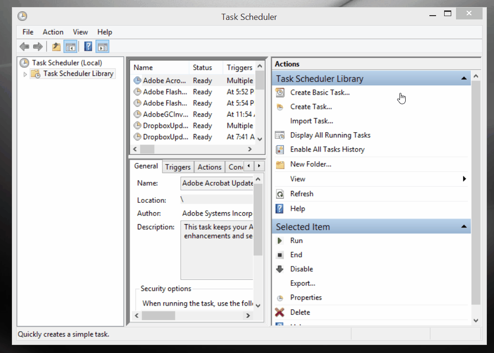

# Scheduling Tasks

If you have a task that needs to be completed regularly, and it's something you can automate with a python script, you can schedule the task to occur at set  times to save you the hassle. It also helps guarantee that the task gets done when it should.

Python has packages available for scheduling tasks, such as `python-chrontab`. However, on a Windows machine it's possibly easiest to use the [Windows Task Scheduler](#windows-task-scheduler). Alternatively, you can use schedule task to run [when you start up your computer](#the-startup-folder).

## Windows Task Scheduler

### 1. Create a `.bat` file

To use the Windows Task Scheduler to , you'll first need to create a `.bat` file. Open a new file on VS Code or notepad and type:

```
"<Path to python executable>" "<Path to script>"
pause
```

* The path to the python executable for me is: `"C:\Users\Erik\Anaconda3\python.exe"` 
* The path to your script is the fully qualified path to your script, don't forget to include the script name and `.py` at the end.

Save the file and change the extension to `.bat` (e.g., `run_me.bat`).

You can run your script by double clicking on the file. Running a `.bat` file is a lot like typing `python <my_script.py>` into the CLI.

### 2. Schedule the task

To schedule the task, type 'schedule task' in the Windows start menu and open the Task Scheduler. Select 'Create Basic Task...' and work through the interface. You can open the settings dialog box for more options (see below) before saving.




#### Additional Settings

* General**: Provide any name you want
* **Triggers**: Add a New Trigger and select the type of trigger you'd prefer. The task can be run at a specific time and day, but also upon logging on to the computer or other options.
* **Actions**: Add a New Action and select 'Start a Program'.
* **Conditions**: You can specify additional conditions here.
* **Settings**: Additional settings here. I recommend selecting 'Run task as soon as possible after a scheduled start is missed', in case the computer isn't on when the task should have been run.

## The Startup Folder

Navigate to your `.bat` file, right-click and select copy. Use the **Windows key + R** keyboard shortcut to open the Run command. Type in `shell:startup` and click OK. Paste a shortcut to the `.bat` file in this folder and it will run on every startup (you'll need to restart for this to take effect).

Note that if you shut down your computer more than once a day, this will run the script multiple times that day. If you just want a daily task to run, use the Task Scheduler.


[Read more about using batch files in Windows]( https://www.windowscentral.com/how-create-and-run-batch-file-windows-10 ).