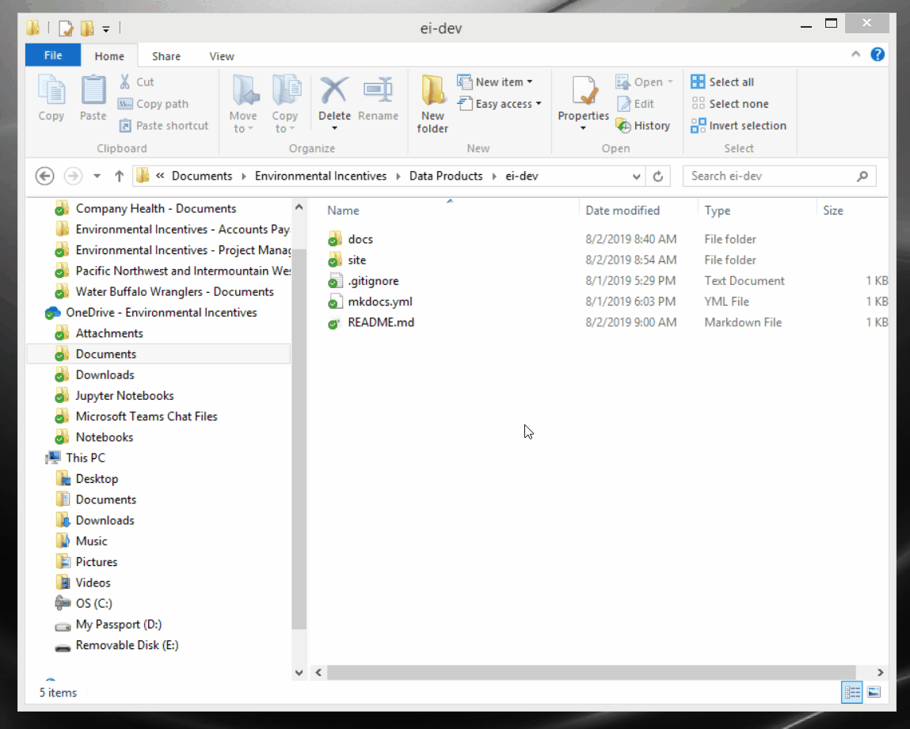

This section describes how to begin a new project and track it on Github. We have two options:

1. [Create the project locally and push it up to Github*](#starting-locally)
2. [Create the project on Github first and clone it down to your computer](#starting-remote)

*If you already have a project started, you've already started locally. 

## Starting Locally

 If you have already started a project or prefer to work from your local machine first, follow these steps:

### 1. Create the project directory

In Windows Explorer, navigate to the folder in which you will create your project directory (or the root of an existing project directory). Right-click and select 'GitBash Here' to open an instance of Bash. 



*Skip the following paragraph if you already have a project started*.

Use the command `mkdir <project-name>` (replace `<project-name>` with the name of the directory for the project) to create a folder. Next, use the command `cd <project-name>` to move into that folder.

### 2. Initialize git

Use the command `git init` to initialize git. A new repository named .git will be created within the directory which stores all of the git version control. You don't need to have GitBash open during your editing sessions, this folder will take care of all of your version control. If for some reason you want to stop tracking with git and lose all of your previous versions, just delete this folder.

### 3. Create a .gitignore and README.md file

Use the command `touch .gitignore` to create a new file named .gitignore. This file will be used by git to ignore files in the project that should not be tracked. Use the command `code .gitignore` to open VSCode to edit the file (or however you would open and edit files). Using one line per folder or file, list all folders or files to be ignored. Wildcards (i.e., globbing patterns) are honored. Each project will be different but consider including `*.pyc`, `venv`, `idea`. See this [GitHub help page](https://github.com/github/gitignore) for more on .gitignore files and this [repo](https://github.com/github/gitignore) for suggested files to ignore.

Use the command `touch README.md` to create a README file. This file will automatically be displayed on the repository page on Github. Using the Markdown language, populate this README file with important info as necessary.

### 4. Commit your initial file(s)

We'll use a fast-forward commit to get the first batch of files/folders into our git repository. Use the following command:

```bash
git commit -am "Initial Commit"
```

You will learn more about commits and other features of git in the Using Git section.

### 5. Create a Github repository 

Navigate to your [Github.com](#https://github.com) page and login. Click the green Create New Repository button. Name it with the same name you used in step 1 for the project directory. Provide a description. The repository will be public. DO NOT create a README or .gitignore file.

After you click 'Ok', Github will provide instructions for importing your project files into the repository. Use HTTP or SSH if you have it set up. Copy the url provided to your clipboard. You'll use two commands in GitBash to accomplish this:

```bash
git remote add origin <url>
git push -u origin master --tags
```

The first line establishes a remote connection to the repository. Replace the url with the url provided by github to your project repository. Note that you can change the name 'origin' to anything you'd like, but origin is used by convention. You will be prompted to sign into your Github account.

The second line 'pushes' your files/folders up to Github. The `-u` flag tells Github to track these files/folders along with master, while the `--tags` flag will move any messages from previous commits.

If this fails, it may be because you already have a remote established named 'origin'. Try `git remove rm origin` to remove any existing connections, or change the name `origin` to something unique. To confirm your remote connection was established, use the command `git remote -v`. 

### 6. Create your project structure and begin coding!

At this point, you may wish to switch into your IDE and open the project folder to build your project architecture and begin coding. Follow the workflow described in the Using Git section as you work.

## Starting Remote

In this option, we'll start by creating a repository on Github and then clone that down to our computer. You can copy files/folders into this newly created repository if you'd like.

### 1. Create a Gihub repository

Navigate to your [Github.com](#https://github.com) page and login. Click the green Create New Repository button. Provide a description. The repository will be public. Create a README and .gitignore file. Optionally add a license.

### 2. Clone the remote repository

Within the project repository on Github, click the 'Clone or Download' button. Use HTTP or SSH if you have it set up. Copy the url provided to your clipboard.

In Windows Explorer, navigate to the folder in which you will create your project directory. Right-click and select 'GitBash Here' to open an instance of Bash. 

Clone the repository into this folder with the command:

```bash
git clone <url>
```

where you replace `<url>` with the copied url (use Shift+Insert to paste into Bash). You may provide a name for the project following the url if you'd like the folder on your local drive to have a different name than the repository on Github. 

Run `ls` to confirm that the repository was created. Type the command `cd <repository-name>` to move into the repository folder (replace `<repository name>` with the correct name).  

If you need to copy files/folders into the repository, use the command `cp -R <~/path/> .`. Replace `<~/path/>` with the correct path of the source folder/file. The `-R` flag signifies recursive and copies everything from within the folders as well. The `.` simply means the current directory, so your copying everything from the path provided to the current directory.

### 3. Populate the .gitignore file

The .gitignore file will be used by git to ignore files in the project that should not be tracked. Use the command `code .gitignore` to open VSCode to edit the file (or however you would open and edit files). Using one line per folder or file, list all folders or files to be ignored. Wildcards (i.e., globbing patterns) are honored. Each project will be different but consider including `*.pyc`, `venv`, `idea`. See this [GitHub help page](https://github.com/github/gitignore) for more on .gitignore files and this [repo](https://github.com/github/gitignore) for suggested files to ignore.

### 4. Create your project structure and begin coding!

At this point, you may wish to switch into your IDE and open the project folder to build your project architecture and begin coding. Follow the workflow described in the Using Git section as you work.