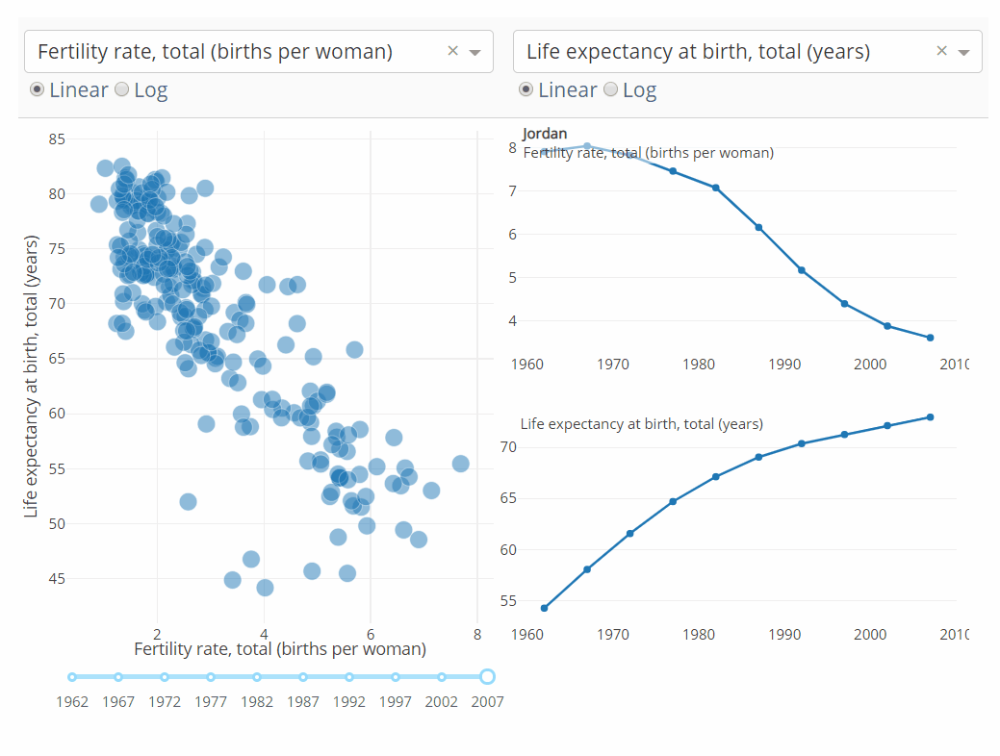

# Dash

[Dash](https://dash.plot.ly/?_ga=2.8778997.1992613160.1580408450-1790432314.1580408450) is a Python framework for building analytic web applications. As it's name suggests, it's especially good for building interactive dashboards. The strengths of this package lie in how it bridges the gaps between your app's analytic functionality, the web, and your user. Dash obviously integrates with Python and all of its functionality, but also provides a fairly intuitive interface to interact with the DOM (more on that below) and includes user interface components (i.e., *widgets*) that invite interactivity. 

I recommend taking a day to work through the examples in the [User Guide](https://dash.plot.ly/) and exploring what's possible in the [gallery](https://dash-gallery.plotly.host/Portal). Once you've done that and built your first app, you can come back here for a quick refresher. Also worth noting that Dash 1.0 is relatively new, and a lot of the guidance you'll find in forums and on YouTube is outdated, so start with the official documentation and the very helpful [Dash community](https://community.plot.ly/).

!!! info "The DOM"
    DOM is short for document-object-model. The DOM is how web browsers display information on web pages. The DOM is represented by HTML (Hyper-Text Markup Language). Having a decent grasp on HTML will help you as you customize your Dash app. Check out [w3schools](https://www.w3schools.com/) or [codeacademy](https://www.codecademy.com/learn/learn-html) for a crash course. You don't need to know everything, but it's helpful to know how Dash is converting your Python code to HTML, and the options you have through [Dash's HTML components](https://dash.plot.ly/dash-html-components).

## Installation

Dash isn't distributed through `conda` (yet), so you'll need to install using `pip`. Might as well [initialize a git repository](../git/initializing-git.md) and create a [virtual environment](../development/virtual-environment) while you're at it. Use `virtualenv` since this is a `pip` environment and that's what the Dash documentation suggests. Make sure your prompt is in the root folder of your project directory (or `mkdir` and `cd` into it).

```powershell
virtualenv venv
source venv/bin/activate
pip install dash==1.8.0  # check the docs for the latest version
pip install plotly
```

Here are the files they recommend including in your `.gitignore` file.

```
venv
*.pyc
.DS_Store
.env
```

## Patterns

A Dash app consists of a layout, which describes the organization of the app, and callbacks, which create interactive functionality. 

### Layout

The Dash layout consists of both [Core Components](https://dash.plot.ly/dash-core-components) and [HTML Components](https://dash.plot.ly/dash-html-components). Core components represent your user interface widgets. HTML components expose the HTML tags used in the DOM as Python classes.

Here's a basic template layout to get you started.

```python
# -*- coding: utf-8 -*-
import dash
import dash_core_components as dcc
import dash_html_components as html

external_stylesheets = ['https://codepen.io/chriddyp/pen/bWLwgP.css']

app = dash.Dash(__name__, external_stylesheets=external_stylesheets)

app.layout = html.Div(children=[
	# YOUR APP GOES HERE
])

if __name__ == '__main__':
    app.run_server(debug=True)
```

Within the `app.layout` variable, you'll define all of your core components and html components within a `div` HTML element as a list. `app.layout` essentially defines the body of the DOM. Everything you want on your webpage must be included here.

The external stylesheet provides styling through CSS to make your app look a bit better. You can also provide [custom CSS](#custom-css) and [custom JavaScript](#custom-javascript).

#### Core Components

Dash's [core components](https://dash.plot.ly/dash-core-components) facilitate user interaction and include dropdowns, sliders, a variety of inputs, checkboxes, radio items, buttons, date pickers, file uploaders, tabs, dialogs, and graphs (i.e., charts). The [tables component](https://dash.plot.ly/datatable), recently released, allows for interacting with and even editing tables. As well, you can pass Markdown through the Markdown component. There are a few additional libraries of components available, check out the [list](https://dash.plot.ly/) under *Open Source Component Library* (I recommend checking out [Dash DAQ](https://dash.plot.ly/dash-daq) library). Each component also has an array of properties that can be set (or updated through callbacks), refer to each component's documentation. 

#### HTML Components

The [HTML components](https://dash.plot.ly/dash-html-components) provide all of the other functionality you'll need to create a web page by exposing a majority of the available html tags. You'll most often be using `html.Div` to create areas within the web page to show widgets, content, and even to store information without showing it.

#### Styling

The CSS provided by the external stylesheet offers some basic styling and a grid feature. Check out the [codepen](https://codepen.io/chriddyp/pen/bWLwgP?editors=1100) to see the documentation and example styles available to you. To use the CSS, you need to assign a class to the component. You can do this by including a variable `className` in the list of component properties. Convert any dots (`.`) in the CSS to spaces in your code. For example, a primary button (`primary.button`) is created with:

```python
html.Button(
    children='Click me!',
    id='my_button',
    className='primary button'
    )
```

#### Grids

To create side-by-side elements, access the grid. First, create a `div` where you will include the side-by-side elements. Assign to each component the number of 'columns' you want the component to occupy out of a possible twelve. Assign to the `div` element the class name of 'row'. This example would create two side-by-side buttons, each occupying one half of the screen:

```
html.Div([
    html.Button('Submit',
    id='submit-button',
    className='six rows'),
    
    html.Button('Undo',
    id='undo-button',
    className='six rows')
], className='row')
```

#### Bootstrap

Another stylesheet makes available Bootstrap (a popular user interface library for the web), called [dash-bootstrap-components](https://dash-bootstrap-components.opensource.faculty.ai/). This stylesheet changes the development patterns with new syntax for the layout, so decide if you want to use Bootstrap before getting too far in development. 

### Callbacks

Callbacks handle the interactivity of the app. Callbacks listen for events, like clicking on a button, and then handle the action required to make the button do it's job. You can update almost any property of any component through a callback. For example, you might want to update the figure property of a `dcc.Graph` component based on the value of a slider or other input. In other words, you will change the way the graph looks whenever the user interacts with the relevant widget.

To create a callback, import `Input` and `Output` from `dash.dependencies`, use the callback decorator, provide one or more outputs and one or more inputs, and then define a function that handles the interaction.

```python
from dash.dependencies import Input, Output
# Put callbacks below the layout or in a separate file

@app.callback(
    Output('my-output', 'children'),
    [Input('my-input', 'value')]
)
def my_function(first_input):
    return first_input ^ 2
```

If you have more than one output, they should be passed as a list. The inputs need to be included in a list, regardless of how many there are. The inputs are passed to the function in the order they are listed. Two parameters are passed to the `Output` or `Input`, first the `id` of the component and second the property of interest. Thus, any component that supports interactivity must have an `id` property assigned (also, all components in your callbacks must also be represented in the layout, or you'll get an error). 

Callbacks can also be chained to create a cascade of changes to create dynamic UIs where one input component updates the available options of another input component. Provide the `Output` of one callback as the `Input` of another callback.

Note that you won't provide the value for the `Output` components you will be updating within `app.layout`. This is because Dash automatically fires all of the callbacks upon page load, so anything you provide up front will simply be overwritten. For example, if you have a callback that updates the figure of a `dcc.Graph` component, don't include a `figure=` property for that graph in the `app.layout` section, you only need provide it an `id=` property.

!!! warning
    Don't update variables that are outside of the callback's scope, as this can introduce unusual behavior.

#### State

Callbacks fire whenever there is a change to the input component(s). You might instead want to, say, wait for the user to finish updating a form before you fire the callbacks associated with those input fields. For this, you can use a `State` variable.  Include `State` variables as you would `Input` variables, in a list below the `Input` variables.

```python
from dash.dependencies import Input, Output, State

@app.callback(
    Output('my-output', 'children'),
    [Input('my-input', 'value')],
    [State('my-input-state', 'value')]
)
def my_function(first_input, state_input):
    return first_input ^ state_input
```

This example raises the value of the `my-input` component by the `my-input-state` component, which allows the user to specify the power to raise to without re-calculating all of the outputs. The result is used to update the `children` property of the `my-output` component (children properties are common for text outputs, so this would print the result to the screen).

#### PreventUpdate & NoUpdate

If you want to include logic that prevents updating a component based on the property of some input, you can use `PreventUpdate`.

```python
from dash.exceptions import PreventUpdate

@app.callback(
    Output('my-output', 'children'),
    [Input('my-input', 'value')]
)
def my_function(first_input):
    if first_input is None:
        raise PreventUpdate
    else:
        return first_input ^ 2
```

Here, if the input is not filled in, the output component will not be updated. 

Alternatively, you can  use `dash.no_update` to tell Dash to skip updating a specific output based on an input value. For example, if you want to update one output, but not another, based on an input, return `dash.no_update` for that output.

#### Interactive Graphing

One really great feature of Dash is its ability to update multiple graphs based on the built-in interactivity of Plotly figures. Plotly figures support hovering, clicking, selecting, and zooming on charts and their data. Using Dash, you can update any component based on the user's interaction with the graph. This is probably best illustrated. Note the charts on the right are updated based on where the cursor hovers.



See the [documentation](https://dash.plot.ly/interactive-graphing) for details.

### Running the app

Run the app in the terminal with:

```powershell
python <app.py>
```

where `<app.py>` is the path to your python script containing the application. By custom, this is called `app.py`. Visit [localhost:8050](http://127.0.0.1:8050) in your browser (or whichever port the terminal states).

## Deployment

While Dash does provide a paid hosting platform, it's better to host on Heroku.

!!! warning
    Don't deploy with Debug set to True
    (In app.py, set app.run_server(debug=False))

#### Heroku

Check out our [Heroku tutorial](../deployment/heroku.md) for general guidance and the [step-by-step tutorial](https://dash.plot.ly/deployment) in the official documentation (under *Heroku example*). There are a few configuration options and gotchas specific to Dash you'll need to know about that are covered in the tutorial.

#### Flask

Dash is written on top of `flask`, and so integrates fairly easily with Flask applications. Deploying your Flask application is exactly the same as deploying your Dash application.

#### Embedding in existing websites

Dash apps (and any other apps hosted through Heroku) can be inserted into a webpage using the iframe tag.

```html
<iframe src="<path-to-my-app.com>", height=800, width=700></iframe>
```

Note that with the free tier, the page may timeout before the app is spun up and loaded. You'll need to reload the site, which isn't the best user experience, so consider upgrading any app that you want to embed in this way.

## Tips & Tricks

### Storing data & performance

If your app includes expensive analytics, you may want to separate that process from the interactivity of your app to avoid expensive computations with every change of inputs. One option is to store the data in a hidden `div`. This will store the data in the user's browser for the duration of their session. Data has to be converted to a string like JSON for storage. You can either store the fully computed data or you can perform some computation, save the intermediate results, and then with a chained callback access that information to complete the interaction. The pre-processed data will be available to subsequent callbacks where you stored it. Finally, you can cache the data using `flask`. This will also allow for persisting the data between sessions. Once you're ready to worry about optimizing performance, see the [docs](https://dash.plot.ly/sharing-data-between-callbacks).

### Multi-page Apps

If you need basic functionality for multiple pages, check out the Tabs core component. If you really need a multi-page app, you can either embed multiple Dash apps in a Django or Flask app, or check out this [guidance](https://dash.plot.ly/urls). I'd also recommend this helpful [Towards Data Science](https://towardsdatascience.com/how-to-build-a-complex-reporting-dashboard-using-dash-and-plotl-4f4257c18a7f) article. 

### Extending

You can [write your own Dash components](https://dash.plot.ly/plugins) in React JS, a popular JavaScript library for building user interfaces. You'll need to fork the sample component library and, of course, be comfortable working with React JS.

#### Custom CSS

To add your own CSS, save the CSS files in a folder named `assets` in the project's root directory. Dash will automatically serve any CSS it finds here. Note that the CSS files are added in alphanumeric order, so if the order matters, prepend numeric values to the filenames to get the loading order you want. You can also copy the [provided CSS](https://codepen.io/chriddyp/pen/bWLwgP.css) into this folder and edit it.

#### Custom JavaScript

To add custom JavaScript, simply include a JavaScript file in the `assets` folder in the project's root directory. Dash will automatically include it. However, they recommend building new Dash components for any significant functionality you want to add.

