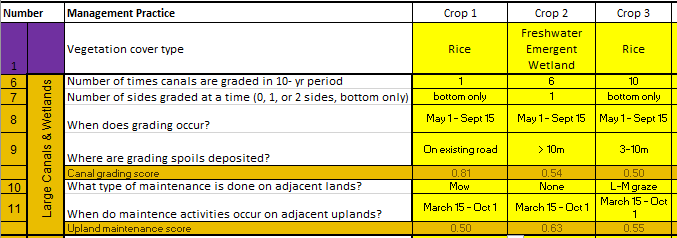

# Giant Garter Snake Habitat Quantification Tool 
## Excel-based Tool for Understanding Habitat Functionality 

The Central Valley Habitat Exchange developed a [multi-species habitat quanitification tool](http://cvhe.org/tools) (HQT) to understand not only the quantity (e.g. acres) but also the quality of habitat across the Central Valley of California. This tool was focused on species that co-exist with agricultural landscapes. 
### Giant Garter Snakes
Giant garter snakes were included in the original tool. This species, once common in the seasonal wetlands of the Central Valley, has seen drastic habitat reductions and is now listed as endangered under the Endangered Species Act and the California Endangered Species Act.
 

These snakes now live in agricultural canals and rice fields, and are often impacted by standard maintenance activities, like dredging canals or grading levees. Because this species relies on human-created ecosystems and is heavily regulated by federal and state wildlife agencies, there is a great need to understand their habitat, be able to compare habitat sites, and demonstrate improvement of habitat for the snake.

## Benefits of the HQT 

The giant garter snake HQT was developed by Environmental Defense Fund and a Technical Advisory Committee of giant garter snake experts. EI helped to ensure the tool was specifically designed to be used by conservation organizations, agencies, and technically savvy farmers and landowners. As such, the tool is
- Excel-based, with 13 attributes needed
- Minor spatial analysis can be completed in ArcGIS or Google Earth
- Includes management strategies that will likely lead to improved habitat
- Combines landscape, regional, and site-specific attributes into one clear metric (% functionality)
- Can be used on working lands and protected wetlands and everything in between

We believe tools are only useful if they are used. Given the identified users of this tool, having a relatively simple excel sheet that completes the complicating weighting of attributes behind-the-scenes was critical for tool success.

##  Adaptive Management & Proliferation

We at EI were using the tool to help the California Department of Water Resources, who manages hundreds of acres of GGS habitat, demonstrate habitat improvements. Through this process, we identified several modification that would make the tool more usable and useful to meet its goals. 

Our team
1. Identified consequences of specific attribute weights in the tool that were leading to misaligned incentives
2. Developed a scenario analysis to understand the true impact of identified attributes
3. Underwent adaptive management process with the TAC to improve the tool so it properly weighted specific attributed
4. Trained DWR staff on use of the tool, including in-field data collection and desktop analyses
5. Worked with DWR to integrate the HQT into their standard practices
