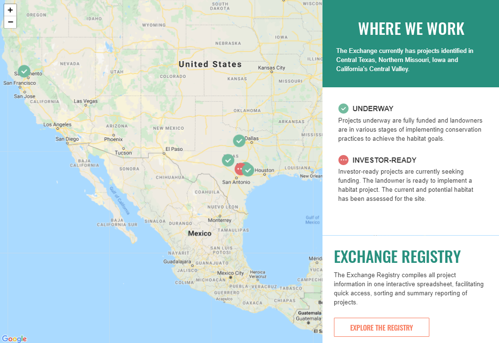
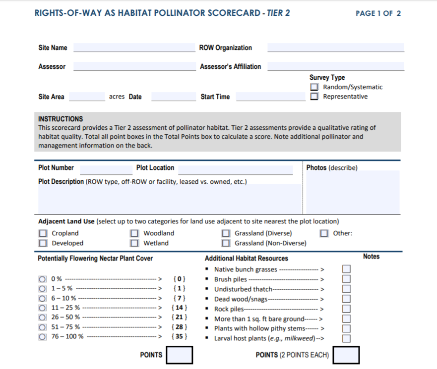
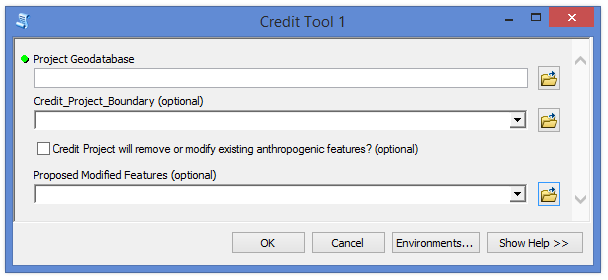
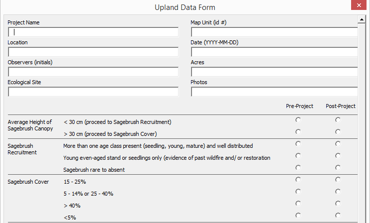

# Project Portfolio

These are a few of our projects. Peruse at your leisure.

## Sustainable WASH Systems Monitoring Plan Visuals

We worked with the Sustainable WASH Systems team to explore, analyze and create data visualizations for Performance Indicators included in their Monitoring, Evaluation and Learning (MEL) Plan report.

<iframe src="https://albumizr.com/a/Nu-i" scrolling="no" frameborder="0" allowfullscreen width="700" height="400"></iframe>

---

## Monarch Registry

We worked with a web design firm to develop the [Monarch Registry](http://monarchhabitatexchange.org/projects) for the Monarch Habitat Exchange. Our role was to design the database, identify reporting metrics, and provide input on visual aesthetic.

\# custom web app, registry, database

---

## Nevada Credit System Site Screening Tool

The [Nevada Site Screening Tool]( https://www.enviroaccounting.com/NVCreditSystem/SiteScreeningTool/Basics ) allows landowners to quickly screen their private lands for potential to participate in the Nevada Credit System based on a number of factors relevant to sage-grouse habitat quality. We partnered with Sitka to develop the web app, its algorithms, and outputs.

\# custom web app, spatial analysis

---

## Roadside Managers Monarch Tool

We partnered with UX design students to design an interface for a [mobile field data collection app]( https://enviroincentives.com/blog/where-monarch-conservation-meets-the-road-a-mobile-app-for-highway-departments/ ) for roadside managers to quickly assess the quality of monarch habitat on roadsides. The design was used to spur interest from funders and as the basis for the final mobile field data collection app design, which was build on ESRI's Survey123.

\# UX design, Survey123, mobile app

---

## Pollinator Habitat Quantification Tool

The Pollinator Habitat Quantification Tool evaluates habitat quality in agricultural landscapes for a user-specified list of native pollinators. The tool implements an algorithm described [here](https://doi.org/10.1093/aob/mcp069). The tool is presented in this [ESRI StoryMap](http://arcg.is/0m8i99), which can be viewed below (scroll).

<iframe width="100%" height="800px" src="http://www.arcgis.com/apps/Cascade/index.html?appid=1d847704b6b74e73a5382818ad5cbc8a" frameborder="0" scrolling="yes"></iframe>
\# ESRI StoryMap, ArcGIS

---

## Pollinator Scorecard

The [Pollinator Scorecard]( http://rightofway.erc.uic.edu/resources/tools/ ) is designed for electric utilities and other rights-of-way managers to rapidly assess pollinator and monarch habitat on their rights-of-way. It is the required assessment method for the USFWS Monarch Candidate Conservation Agreement with Assurances. Data may be collected through a fillable PDF form or ESRI's Survey123 app.

\# Low-tech, PDF, Survey123, field protocol, datasheets

---

## San Diego Incentives Demographics

We created a [mapping application](https://arcg.is/1iyurH) to inform the design of rebates and incentives program in San Diego County by evaluating basic demographic information.

<iframe width="100%" height="640px" src="https://www.arcgis.com/apps/MapSeries/index.html?appid=91d65bcd563c497689b49e0b09cb8e3e" frameborder="0" scrolling="no"></iframe>
\# ESRI StoryMap, Spatial Analysis, Mapping

---

## Monarch Habitat Quantification Tool

The [Monarch Habitat Quantification Tool]( http://monarchhabitatexchange.org/tools ) is designed to assess monarch habitat quality in agricultural landscapes. We led a team of monarch experts to develop an assessment protocol and habitat quantification approach for EDF. The tool includes an Excel-based spreadsheet calculator, field datasheets, and field data collection protocol.

\# Excel, Monitoring Protocol, Datasheets

---

## Sage-Steppe Habitat Quantification Tool

The Sage-Steppe Habitat Quantification Tool facilitates habitat assessment for greater sage-grouse and mule deer in multiple states around the West. Multiple state mitigation programs use a regionalized version of the tool. The tool has been used to inform conservation spending and mitigation of over $1 million (USD). The tool consists of a set of custom script tools using ESRI's ArcGIS API, `arcpy` and Excel spreadsheet calculators.

\# ArcGIS, arcpy, python, spatial analysis, Excel, VBA, Excel forms

---

## Idaho Greater-Sage Grouse Project Calculator

As part of the Sage-Steppe Habitat Quantification Tool, we developed a custom Excel form with VBA scripting to facilitate data entry into the Project Calculator.

\# Excel, VBA, Excel Forms

---

## Aliso Creek Results Chain Primer

The Water Team developed a great introduction to Results Chains that can be tailored to any audience. Check it out below, or download [here](https://docs.google.com/presentation/d/1DProNR0wA22EyTJFvKagufbH6wS61KrarvJpuEeM37Y/edit?usp=sharing).

<iframe src="https://docs.google.com/presentation/d/e/2PACX-1vTC8xT2zfiTxT7W3o4RHTaYwvwRhFaFQhlvE5XvgOUflP-XniWWaP5XIN2Io7E9g8Gp3Z83fD161F_R/embed?start=false&loop=false&delayms=3000" frameborder="0" width="1440" height="550" allowfullscreen="true" mozallowfullscreen="true" webkitallowfullscreen="true"></iframe>
\# Open Standards, Results Chain, Performance Measures

---

## Performance Measure Design

This slide deck introduces a five step process to performance measure design. It's a useful resource when introducing performance measures to new clients or developing proposals.

<iframe src="https://docs.google.com/presentation/d/e/2PACX-1vRSPtltQHq6lh_kcKsvhDPnL_vvx21QmiE6OGJTiNsgsUPB5HNdNu7D26HKj2i7vaOOFu0AI-nXR89G/embed?start=false&loop=false&delayms=3000" frameborder="0" width="1440" height="450" allowfullscreen="true" mozallowfullscreen="true" webkitallowfullscreen="true"></iframe>
\# Open Standards, Results Chains, Performance Measures

## Qualitative Monitoring Dashboard

The Qualitative Monitoring Dashboard reports progress markers for sustainable WASH (water, sanitation and hygiene) systems in Africa. The interactive dashboard allows users to select their municipality and view qualitative indicators and a sustainability scorecard. The dashboard was developed using InDesign before converting to HTML. It is regularly updated and hosted on the [EI website](https://enviroincentives.com/sustainable-wash-systems-dashboard/) (Note it contains sensitive information and is thus password protected).  

\# dashboard, PDF, InDesign, qualitative indicators  

---

## Central Valley Multi-Species HQT

The Central Valley Habitat Exchange developed a [multi-species habitat quanitification tool](http://cvhe.org/tools) (HQT) to understand not only the quantity (e.g. acres) but also the quality of habitat across the Central Valley of California. This tool was focused on species that co-exist with agricultural landscapes. The HQT scoring for giant garter-snake is broken down in the diagram below.

\# Excel, field protocol

---

